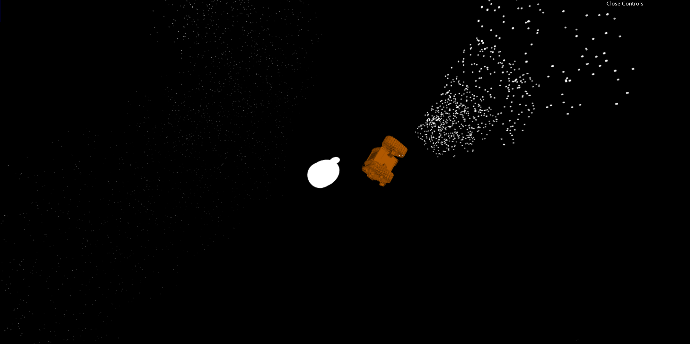
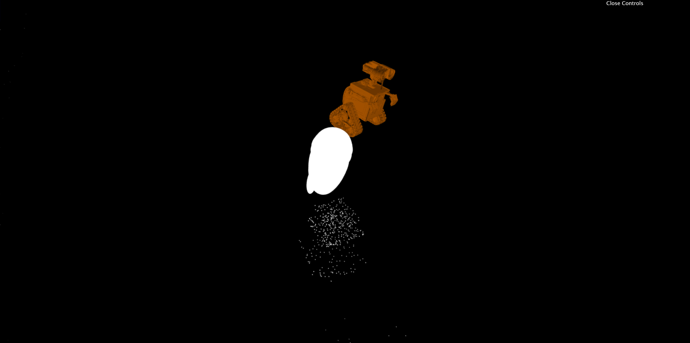

# Define Dancing
_Created for CIS 566 Final Project in Spring 2019_

_Wei (Waley) Zhang (PennKey: wzha)_

[github.io Demo](https://greedyai.github.io/define-dancing/)

## Features
- My scene consists of the following elements so far:
  - __Solid particle system__: To simulate Wall-E's fire extinguisher exhaust particles, I created a solid particle system that properly implements particle pooling.
  - __Wall-E & Eve__: Using downloaded meshes from the Internet, I rendered lambertian shaded models for these two main characters of my scene. I also downloaded some textures and began the process of incorporating them in my fragment shaders.
  - __Particle physics__: The solid particles' emission rate directly affects Wall-E's velocity in a realistic "propulsion-like" manner: the more particles he emits per frame, the faster he moves during that frame.
- Future work:
  - __Texturing__: Currently, my Wall-E and Eve models don't have associated textures that map properly, so I may end up manually texturing them using noise functions (without using a texture file). My Wall-E model also has the issue that some of its polygons are self-intersecting, which causes visual artefacts that mess with the rendering quality. I may end up fully rendering Wall-E using SDFs in the final product instead.
  - __Background__: The background will consist of stars and galaxies rendered using plasma particle effects.
  - __Eve's exhaust__: Eve's rocket exhaust needs to be modeled.
- Extra features I may implement based on available time:
  - __Spaceship Axiom__: Wall-E and Eve are "dancing" around the spaceship Axiom in the actual movie, so I may add this to improve my scene's authenticity.
  - __Dancing pathing__: Currently, the "dance path" that Wall-E and Eve travels on is a continously repeating trigonometric parametric function. I may manually change parts of this path to reflect their motions in the movie to improve my scene's authenticity.

## Screenshots
- __View from the bottom__

- __View from the side__

## Citations
The Wall-E model was downloaded from [here](https://free3d.com/3d-model/walle-rigged-78282.html). The Eve model was downloaded from [here](https://free3d.com/3d-model/eve-53097.html).
