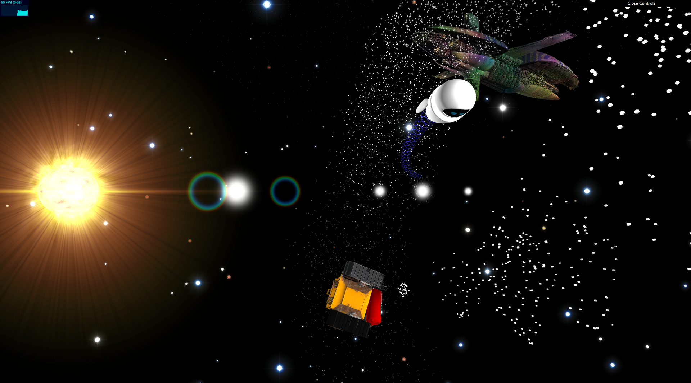
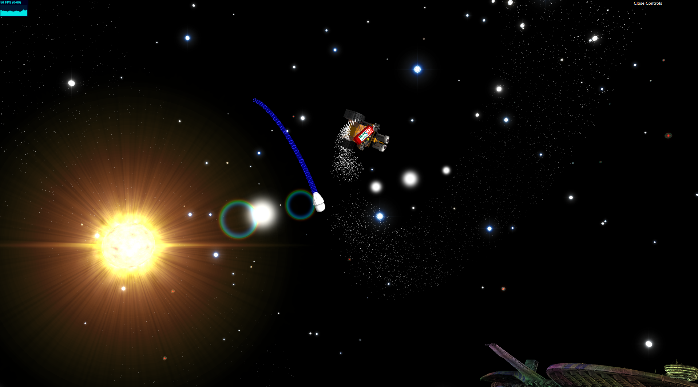

# Define Dancing
_Created for CIS 566 Final Project in Spring 2019_

_Wei (Waley) Zhang (PennKey: wzha)_

[github.io Demo](https://greedyai.github.io/define-dancing/)

## Features
- My scene consists of the following elements:
  - __Solid particle system__: To simulate Wall-E's fire extinguisher exhaust particles, I created a solid particle system that properly implements particle pooling.
  - __Gaseous particle system__: The simulate Eve's jet propulsion exhaust, I created a gaseous particle sytem that samples from a texture to determine its color at any point in time.
  - __Particle physics__: The solid particles' emission rate directly affects Wall-E's velocity in a realistic "propulsion-like" manner: the more particles he emits per frame, the faster he moves during that frame. The gaseous particle systems' size attributes are also influenced by Eve's speed.
  - __Wall-E, Eve, & Spaceship Axiom__: Using downloaded meshes from the Internet, I rendered lambertian shaded models for these three main objects of my scene. I edited the original models via Maya to improve model integrity (ie. to eliminate self-intersecting polygons and other visual artefacts...etc.). I also downloaded appropriate textures and mapped them to these models for my rendering. Furthermore, for the spaceship Axiom, I also procedurally textured it using Worley noise. Finally, Wall-E also has a fire extinguisher, the model and textures of which I downloaded from the Internet.
  - __Stars__: There is a main "Sun" in the scene, rendered using a combination of techniques including texture mapping of colors, lens flare/glow, procedural flame-like effects (ie. corona), and occlusion querying. There are also other, more distant stars, but still rendered in a physically-realistic manner (ie. properly calculating blackbody radiation...etc.). The star locations are determined based on various noise functions. Overall, the distribution of stars appear realistic, akin to constellations.
  - __"Define Dancing"__: Wall-E and Eve travels continously on a repeating trigonometric parametric function, but are offset from each other in such a way that it looks harmonious.

## Screenshots

## Citations
Models and textures have been cited in the relevant files in this repository. See the ./obj directory for such citations.
